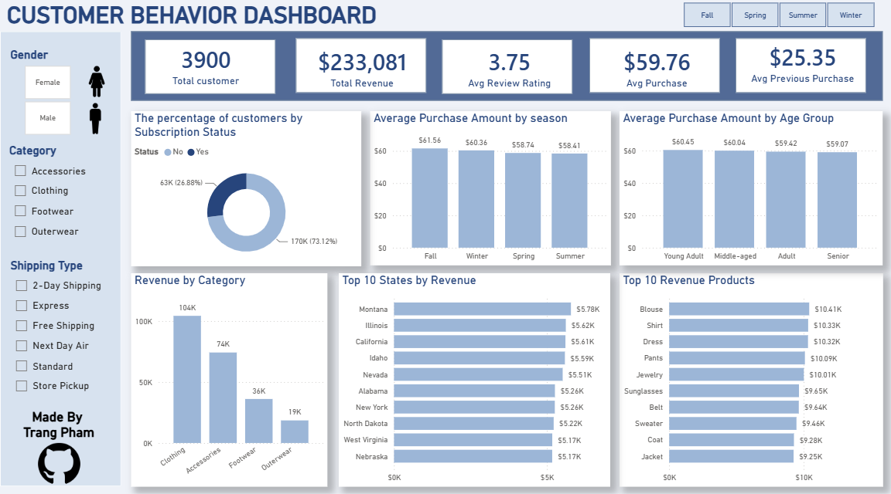

# 👨🏻‍💻Customer Behavior Data Analyst Portfolio Project
The goal of this project is to simulate a corporate-grade end-to-end data analytics workflow demonstrating the ability to translate raw data into strategic business intelligence.
## Business problem
A retail company wants to better understand customer purchasing behavior by analyzing sales performance across customer demographics, product categories, geographic locations, and seasonal trends. The objective is to identify revenue drivers, customer segments, and product performance to support data-driven business decisions.
## 🎯 Objective
- Perform data cleaning and preprocessing using Python (Pandas) 
- Conduct exploratory data analysis (EDA) to identify purchasing patterns and customer trends.
- Store and manage the cleaned dataset using MySQL.
- Build an interactive Power BI dashboard to monitor customer behavior and sales performance.
- Generate business insights and recommendations to support data-driven decision making.

## Dataset use
The dataset contains 3,900 customer records and includes demographic information, purchasing behavior, product details, payment preferences, shipping methods, subscriptions, discounts, and customer reviews.
## Features
- Customer ID
- Age
- Gender
- Item Purchased
- Product Category
- Purchase Amount
- Location
- Size
- Color
- Season
- Review Rating
- Subscription Status
- Shipping Type
- Discount Applied
- Promo Code Used
- Previous Purchases
- Payment Method
- Frequency of Purchases
### 📥 Download Dataset
[Download customer_shopping_behavior_raw_data.csv](https://github.com/hitrangnek/customer-behavior-data-analyst/blob/main/customer_shopping_behavior_raw_data.csv)

## Project Workflow

## 📊 Dashboard

dashboard_image.png
https://github.com/hitrangnek/customer-behavior-data-analyst/blob/a0562e47fe8e45d19ed0153373bcc0af40caee67/dashboard_image.png

